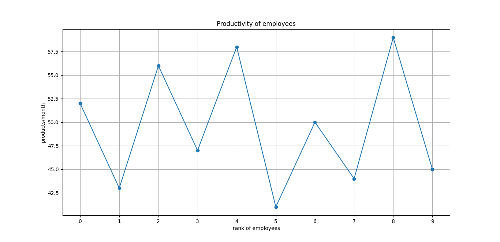

# Company Productivity Analysis

This project is a Python application that analyzes company productivity data from a text file. It calculates various metrics such as total productivity, maximum and minimum productivity, and average products per employee. It also visualizes the productivity data for a company branch.

## Features

- Reads productivity data from a `company.txt` file.
- Calculates the total productivity for each company.
- Identifies the companies with the maximum and minimum productivity.
- Calculates the average number of products per employee for each company.
- Calculates employee salaries based on their productivity.
- Visualizes the productivity of employees in a company branch using a plot.

## File Descriptions

- `main.py`: The main script that drives the data loading, analysis, and visualization.
- `operationclass.py`: Contains the `IntArray` class, which provides methods to work with the productivity data of a single company branch.
- `company.txt`: The input data file where each line represents a company and the numbers on each line represent the number of products produced by each employee in that company.

## How to Run

1. **Prerequisites:**
   - Python 3.x
   - `numpy` library
   - `matplotlib` library

2. **Installation:**
   Install the required libraries using pip:
   ```bash
   pip install numpy matplotlib
   ```

3. **Execution:**
   Run the `main.py` script from your terminal:
   ```bash
   python main.py
   ```

## Output

The script will print the following information to the console:

- The raw productivity data for all companies.
- The productivity data for the first company branch.
- The salaries for the employees of the first company branch.
- The company with the maximum productivity.
- The company with the minimum productivity.

### Productivity Plot

The script will also generate a plot showing the productivity of employees for the first company branch.



*This is a placeholder for the generated plot. You can replace `placeholder_for_plot_image.png` with a screenshot of the plot generated by the script.*

## Code Explanation

### `main.py`

- `productivity_of_company(order, data_frame)`: Calculates the total productivity of a single company.
- `max_productivity(data_frame)`: Finds and prints the company with the highest total productivity.
- `min_productivity(data_frame)`: Finds and prints the company with the lowest total productivity.
- `file_handling()`: Reads the data from `company.txt` and returns it as a NumPy array.
- `mean_products(data_frame)`: Calculates and prints the average number of products per employee for each company.
- `main()`: The main function that calls all the other functions to perform the analysis.

### `operationclass.py`

- `class IntArray`: A class to handle operations on an integer array representing a company's productivity data.
  - `__init__(self, int_array)`: Initializes the `IntArray` object.
  - `display(self)`: Prints the productivity data.
  - `salary(self)`: Calculates and prints employee salaries.
  - `show_data(self)`: Generates and displays a plot of employee productivity.
